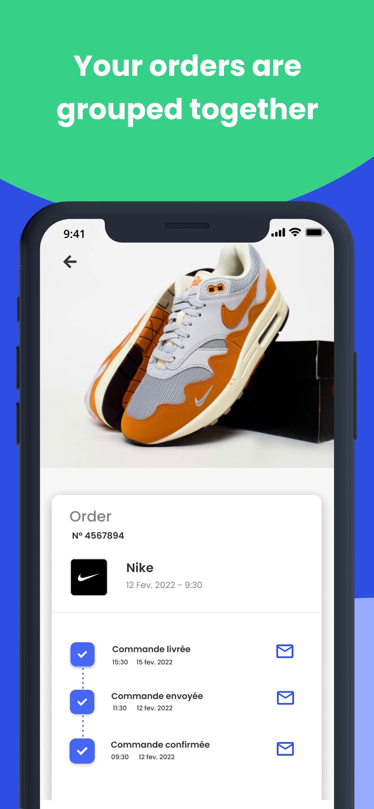

## Portfolio

---

### Mobile Development 

[Paplar 2022](https://paplar.co)

  
  
  
  

  
  
  
  

---

### Web Development

[Konkrete 2022](https://app.konkretedao.com/)

  

[Marché Entrepôt 2022](https://www.marcheentrepot.fr/)

  

  
  
  
  
  
  
  

[Ricoh Reprographie 2014](https://www.ricoh.fr/)

  
  
  
  
  
  

---

### Academic

#### Carnet de contacts - copie de macOS - tout premier projet (2009)

  
  
  
  
  
  

#### Assurance Maladie - cas pratique de master sur 6 mois (2013)

  
  
  
  
  
  

#### Projets divers
- [Algorithme recherche itinéraire - Métro Paris](http://heidyby.free.fr/projects/metro-paris/)
- [Marquage de texte pour Machine Learning](http://heidyby.free.fr/projects/doctrine/)
